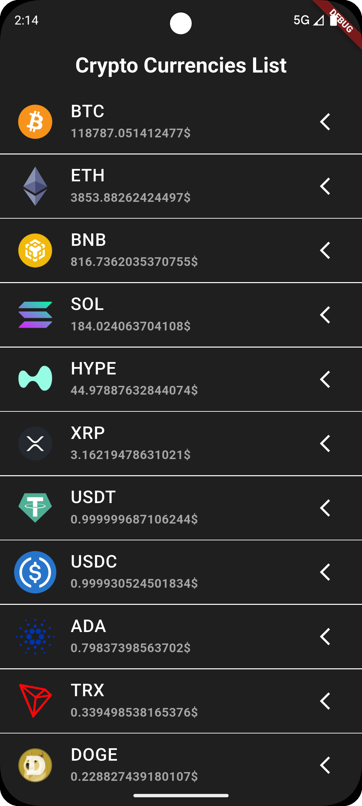
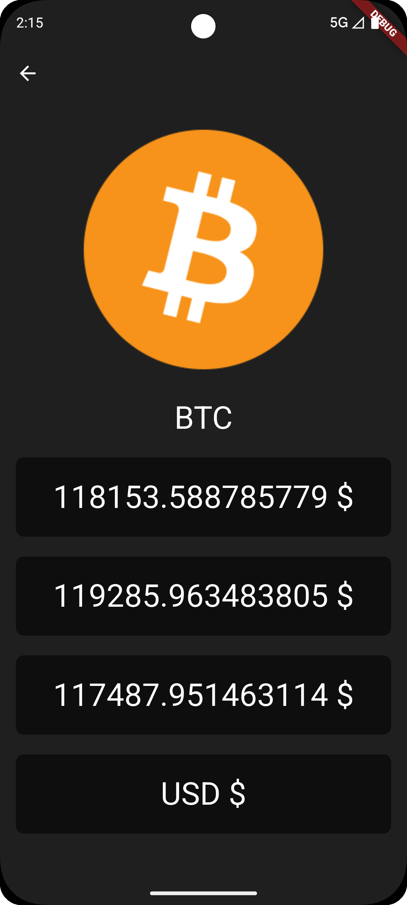

# crypto_coin

Мобильное приложение, разработанное на Flutter.

Проект разработан с использованием следующих технологий:
- **[Dio](https://pub.dev/packages/dio)** — HTTP клиент для запросов к API
- **[flutter_bloc](https://pub.dev/packages/flutter_bloc)** — управление состоянием на основе BLoC
- **[json_annotation](https://pub.dev/packages/json_annotation)** — аннотации для генерации JSON сериализации
- **[json_serializable](https://pub.dev/packages/json_serializable)** — генерация сериализаторов/десериализаторов JSON
- **[build_runner](https://pub.dev/packages/build_runner)** — генерация кода на этапе сборки

